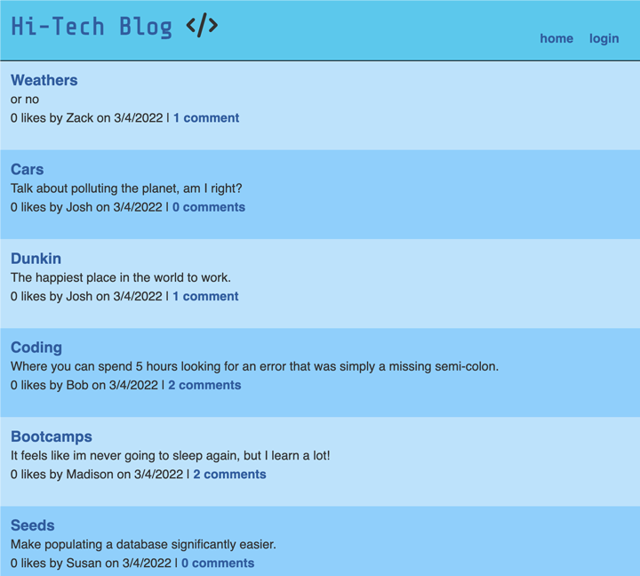
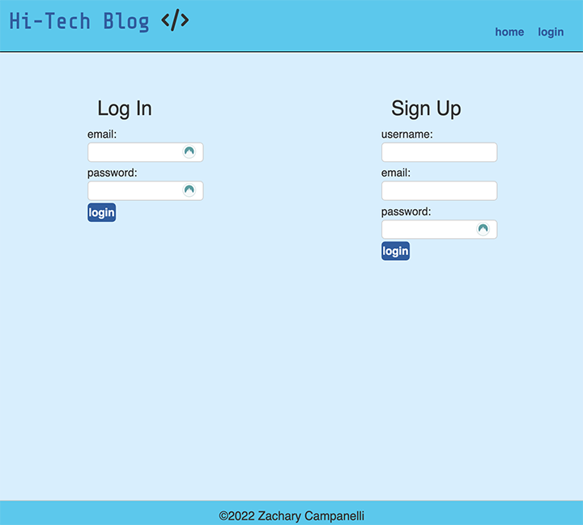
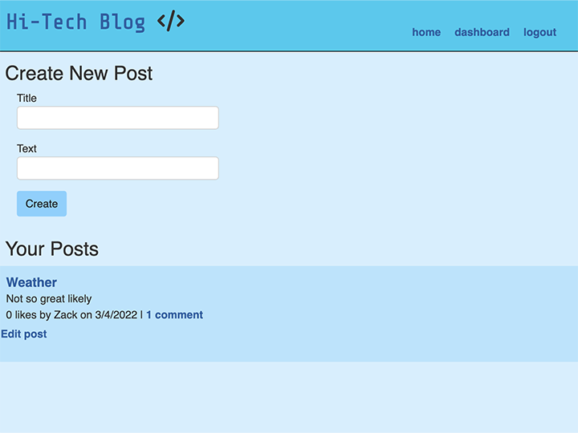

# Hi-Tech Blog
  
## Description 

  
A simple blog website created using the Model-View-Controller design pattern. Technologies used include MySQL2, Sequelize, dotenv, and Express-handlebars

## Table of Contents
* [Installation](#Installation)
* [Usage](#Usage)
* [License](#License)
* [Tests](#Tests)
* [Questions](#Questions)

## Installation
Clone this repository to your computer. Navigate to the root folder then run `npm init` or `npm init -y`. Then run either `npm i` or `npm install` to install the local dependencies

  
## Usage
Open a separate command line and start mysql with the command `mysql -u root p`, then enter your password. Create the database by running the command `source db/schema.sql`. Then you may exit mysql. If you wish to seed the database, use the command `node seeds/index.js`. To start the application, use either `node server.js` or `npm start`

  

## License
A short and simple permissive license with conditions only requiring preservation of copyright and license notices. Licensed works, modifications, and larger works may be distributed under different terms and without source code.  
  
## Tests
Helper functions are tested using the Jest JavaScript Testing Framework

## Questions
If you have any questions, concerns, or comments, feel free to contact me:
  
-GitHub: [Zacharycampanelli](https://github.com/Zacharycampanelli)  
-Email: [zaccamp@optonline.net](mailto:zaccamp@optonline.net)

## Link to Deployed Application
-[Heroku](https://glacial-temple-41748.herokuapp.com/)